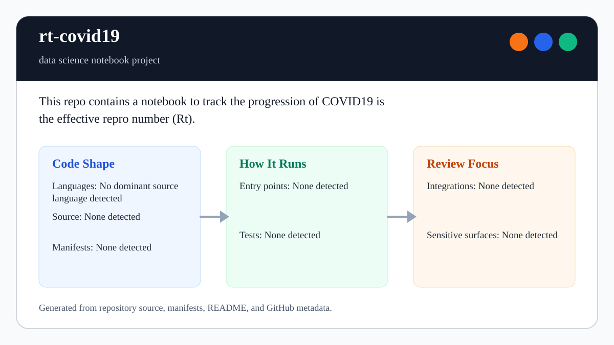

# rt-covid19

<!-- README-OVERVIEW-IMAGE -->


## Overview

`garethpaul/rt-covid19` is a data science notebook project. This repo contains a notebook to track the progression of COVID19 is the effective repro number (Rt).

This README is based on the checked-in source, manifests, scripts, and repository metadata on the `master` branch. The project language mix found during review was: no dominant source language detected.

## Repository Contents

- `README.md` - project overview and local usage notes
- `CHANGES.md` - maintenance history for notebook provenance checks
- `DATA_PROVENANCE.md` - data source, refresh, and interpretation notes
- `Makefile` - local verification entry points
- `Rt-covid19.ipynb` - historical educational notebook
- `docs/plans` - completed maintenance plans for the current baseline
- `plans` - historical implementation notes
- `requirements.txt` - notebook runtime dependencies
- `scripts` - provenance and notebook validators
- `SECURITY.md` - security reporting and disclosure guidance
- `VISION.md` - project direction and maintenance guardrails

Additional scan context:

- Source directories: no top-level source directories detected
- Dependency and build manifests: requirements.txt
- Entry points or build surfaces: none detected
- Test-looking files: no obvious test files detected

## Getting Started

### Prerequisites

- Git
- Python 3 with Jupyter-compatible notebook tooling
- The checked-in notebook metadata records a Python 3.6.7 kernel; use a
  compatible environment for historical reproduction.

### Setup

```bash
git clone https://github.com/garethpaul/rt-covid19.git
cd rt-covid19
python3 -m pip install -r requirements.txt
```

The setup commands above are derived from repository files. Legacy mobile, Python, or JavaScript samples may require older SDKs or package versions than a modern workstation uses by default.

## Running or Using the Project

- Open `Rt-covid19.ipynb` in Jupyter or another compatible notebook viewer.
- The notebook reads county case data from `https://raw.githubusercontent.com/nytimes/covid-19-data/master/us-counties.csv`.
- See `DATA_PROVENANCE.md` for runtime download behavior, preprocessing notes,
  and refresh status.
- The notebook metadata records Python 3.6.7 as the historical kernel version.
- `requirements.txt` keeps `pandas<2` because the notebook uses legacy
  `read_csv(..., squeeze=True)` behavior.
- `matplotlibrc` sets the Agg backend for headless historical reproduction
  runs.
- The committed notebook is source-only: execution counts and rendered outputs
  are intentionally stripped to avoid presenting stale results as a refresh.
- This is a historical educational analysis and is not current public-health guidance.

## Testing and Verification

- `make check` validates notebook JSON, dependency documentation, and data-source provenance.
- `make check` also rejects stored notebook outputs and execution counts.
- `make check` also rejects empty code cells so the source-only notebook does
  not carry unfinished analysis placeholders.
- `make check` also verifies that summary-plot presentation defaults are
  defined in the notebook.
- `make check` also verifies that README and provenance notes document the
  notebook's recorded Python 3.6.7 kernel version.
- `make check` also verifies that `pandas<2` stays documented while the
  notebook uses legacy `read_csv(..., squeeze=True)` behavior.
- `make check` also verifies that `matplotlibrc` keeps the headless Agg
  backend configured.
- `make check` also verifies that notebook and provenance URL references use
  HTTPS.
- `make check` also requires completed canonical plans under `docs/plans`.

When the required SDK or runtime is unavailable, use static checks and source review first, then verify on a machine that has the matching platform toolchain.

## Configuration and Secrets

- No required secret or credential file was identified in the repository scan. If you add integrations later, keep secrets out of git.

## Security and Privacy Notes

- The scan did not identify production authentication, payment, or secret-management code. Treat future additions in those areas as security-sensitive.

## Maintenance Notes

- See `SECURITY.md` for vulnerability reporting and safe research guidance.
- See `VISION.md` for project direction and contribution guardrails.
- See `docs/plans/2026-06-08-rt-covid19-baseline.md` for the canonical
  notebook provenance baseline.
- See `docs/plans/2026-06-08-strip-notebook-outputs.md` for the source-only
  notebook output policy.
- See `docs/plans/2026-06-08-notebook-presentation-defaults.md` for the
  summary-plot default guard.
- See `docs/plans/2026-06-09-empty-code-cell-guard.md` for the empty code-cell
  guard.
- See `docs/plans/2026-06-09-kernel-version-provenance.md` for the notebook
  kernel-version provenance guard.
- See `docs/plans/2026-06-09-pandas-squeeze-constraint.md` for the pandas
  compatibility guard.
- See `docs/plans/2026-06-09-matplotlib-headless-backend.md` for the
  Matplotlib headless backend guard.
- See `docs/plans/2026-06-09-https-url-provenance.md` for the HTTPS URL
  provenance guard.

## Contributing

Keep changes small and tied to the project that is already present in this repository. For code changes, document the toolchain used, avoid committing generated dependency directories or local configuration, and update this README when setup or verification steps change.
